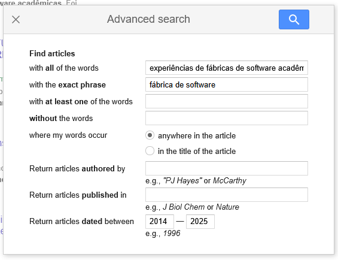
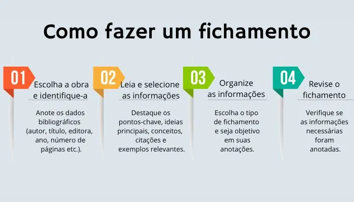

# Fichamento

Pesquisa feita através do Google Scholar

## Query 1: "experiências de faculdades com fábrica de software" deve conter o termo "fábrica de software" em qualquer lugar do artigo

[Link para pesquisa avançada](https://scholar.google.com/scholar?q=experi%C3%AAncias+de+faculdades+com+f%C3%A1brica+de+software+software+%22f%C3%A1brica+de+software%22&hl=en&as_sdt=0,5&as_ylo=2014&as_yhi=2025&as_vis=1)

#### Resultado

Para este termo acima de pesquisa foram encontrados 644 artigos. 

## Query 2: experiências de fábricas de software acadêmicas em Brasília

[Link para pesquisa avançada](https://scholar.google.com/scholar?as_q=experi%C3%AAncias+de+f%C3%A1bricas+de+software+acad%C3%AAmicas+em+Bras%C3%ADlia&as_epq=f%C3%A1brica+de+software&as_oq=&as_eq=&as_occt=any&as_sauthors=&as_publication=&as_ylo=2014&as_yhi=2025&hl=en&as_sdt=0%2C5)

#### Resultado

Para este termo acima de pesquisa foram encontrados 59 artigos. 

### Referências

#### Critérios da revisão sistemática

- Tem que ser artigo, dissertação ou tese. (não inclui livros);
- Pesquisar software no artigo (se tiver ao menos uma ocorrência, ler resumo);
- Ler resumo e verificar se está relacionado a alguma experiência direta ou indireta de fábrica de software.
- Essa experiência é de uma fábrica de software acadêmica?

## Tabela para Query 1

| ID                 | Repositório/Base                                          | Referência ABNT                                                                                                                                                                        | Link                                                      |
| ------------------ | --------------------------------------------------------- | -------------------------------------------------------------------------------------------------------------------------------------------------------------------------------------- | --------------------------------------------------------- |
| tognini2015celia | 8 ENEX (Encontro de Extensão universitária da UFMS)         | Araújo, Reinaldo Felipe Soares, et al. Fábrica de Software da UFMS/CPPP: Desenvolvimento de Sites e Softwares Móveis Educacionais e para o Desenvolvimento Regional. Anais do Encontro de Extensão Universitária da UFMS (ENEX), edição 01, 2014, p. 111. ISSN 2359-4888.             | não encontrado o pdf completo |

> **Dica:** O identificador (ID) em cada entrada do BibTeX é usado para citar a referência em documentos científicos, por exemplo, `\cite{romanha2015fabrica}`.

## Tabela para Query 2 
| ID                 | Repositório/Base                                          | Referência ABNT                                                                                                                                                                        | Link                                                      |
| ------------------ | --------------------------------------------------------- | -------------------------------------------------------------------------------------------------------------------------------------------------------------------------------------- | --------------------------------------------------------- |
| romanha2019fabrica | Universidade Estadual Paulista (Unesp)         | Romanha, Silas Dias, Jorge Muniz Junior, and Jose Roberto Dale Luche. "Fábrica de software em instituições de ensino superior: análise de universidades brasileiras." Revista Produção Online 19.2 (2019): 408-429.             | https://www.producaoonline.org.br/rpo/article/view/2813/1782 |
| romanha2016modelo | Anais da Escola Regional de Engenharia de Software (ERES) | Romanha, Silas Dias. "Um modelo de fábrica de software em Instituições de Ensino Superior." (2016). | https://repositorio.unesp.br/entities/publication/7d6c3319-b9ee-45c8-a3c0-554662b3cfa2  |